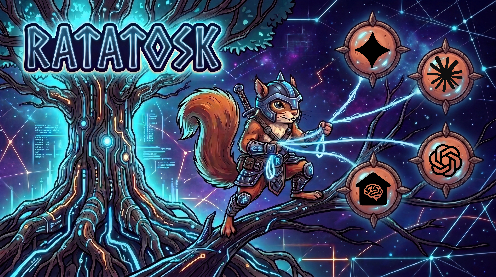
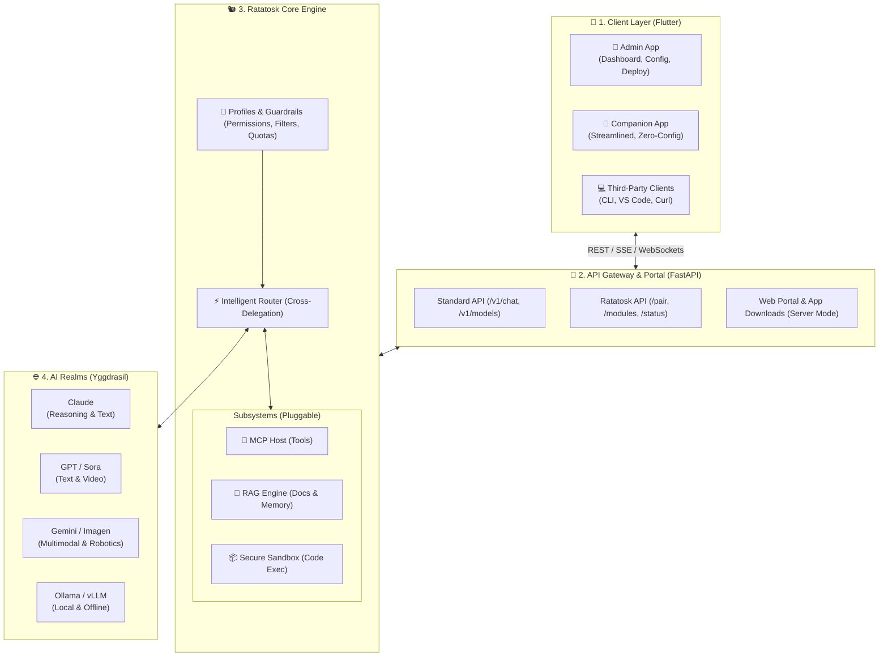
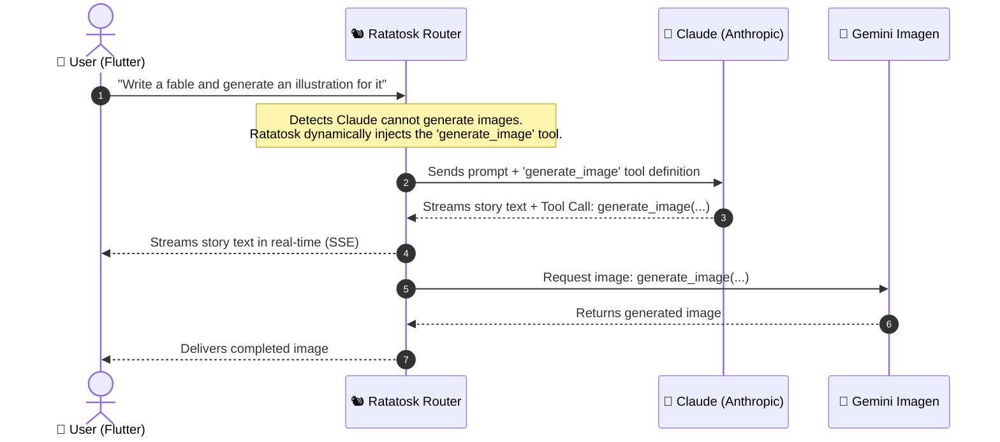

# 

  <strong>The universal and highly customizable orchestrator that unifies all AI models and combines their skills.</strong>

  
  
  
  

---

## Why Ratatosk 🐿️

In Norse mythology, **Ratatosk** is the squirrel that runs along the world tree, Yggdrasil, carrying messages between all the realms.

Today, every AI has its own strengths and limitations:
- **Using Claude and need an image?** 👉 Anthropic does not provide a native image generation model, so Ratatosk delegates the request to Gemini or Flux in the background.
- **Want a video from a local server?** 👉 Ratatosk orchestrates the call to OpenAI Sora or Runway.
- **Need specialized models?** 👉 Integrate Gemini's computer vision and robotics, or run private local models via Ollama without modifying your client code.
 
---

## Built for Everyone 🎯

Ratatosk is designed for everyone—from everyday users with zero technical background to families, teams, and experienced developers:

* **Family** : Simple and secure, with safety guardrails for children and code execution disabled.
* **Teams & Companies** : Shared knowledge bases (RAG), cost control, usage monitoring, and private models.
* **Power Users & Developers** : MCP tools, execution sandboxes, and unrestricted local models.
 

---

## Two Ways to Run 🚀

| 🖥️ Local Mode | 🌐 Server Mode |
|:---|:---|
| **Runs locally on your computer** | **Deployed on a remote server or VPS** |
| **Best for:** Developers, creators, and individuals working on their own machine. | **Best for:** Families, teams, communities, and businesses. |
| The API runs on `localhost`. Instant setup, ultra-low latency, and zero network exposure. | Distributes a secure, simplified companion app to members via a built-in download portal with QR-code pairing. |
 

---

## System Architecture 🏗️

### Cross-Delegation in Action ⚡

How Ratatosk bridges capabilities between models behind the scenes:

